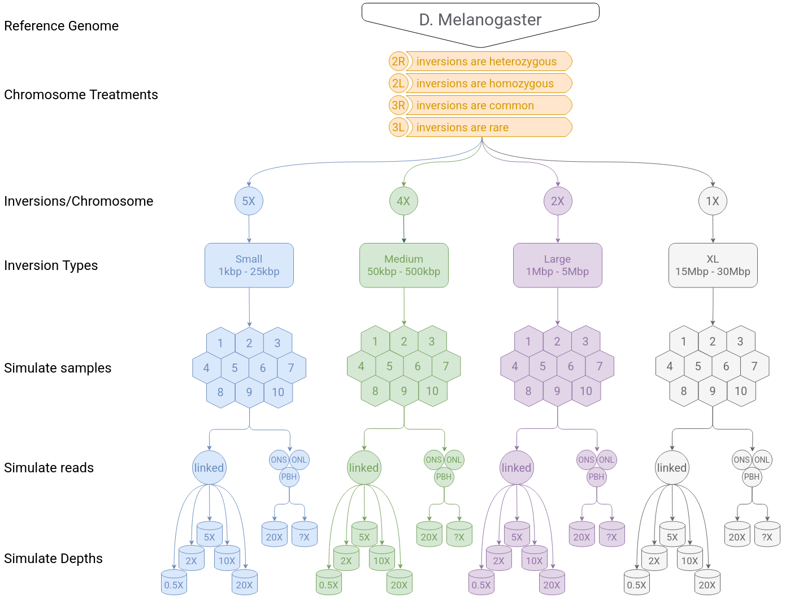

# Linked Read Inversion Detection Performance Simulations
This repository and subsequent notebooks track the workflow to simulate the inversions (and SNPs) onto 10 individuals for 5 different depth treatments. This work aims to understand haplotagging linked-read and workflow performance for detecting inversions of various sizes in different sequencing depth regimes. The simulation outline is as follows:

